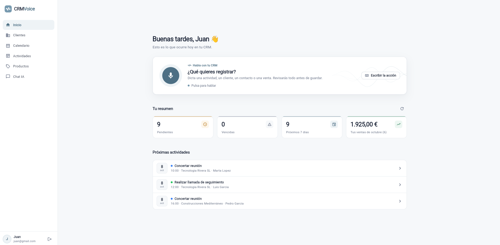
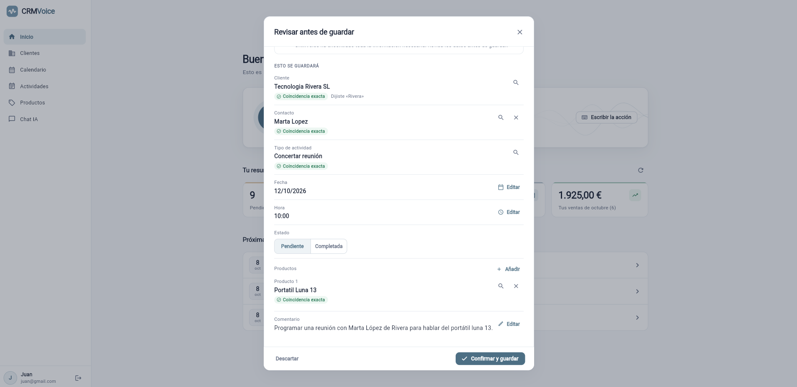
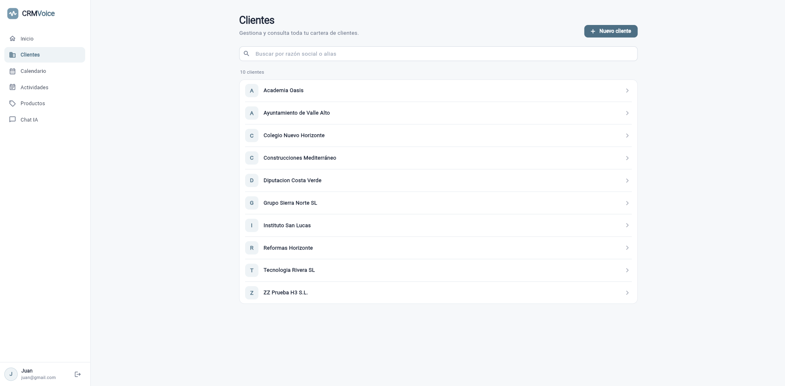
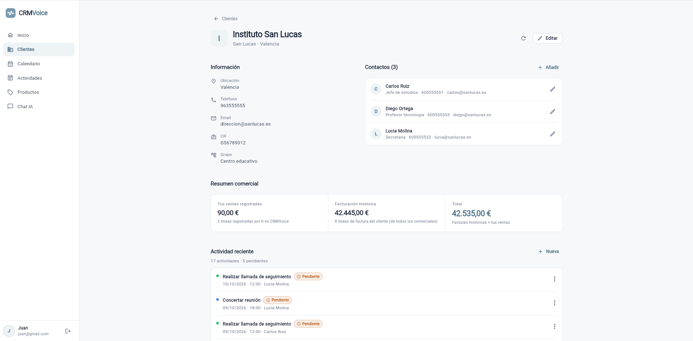
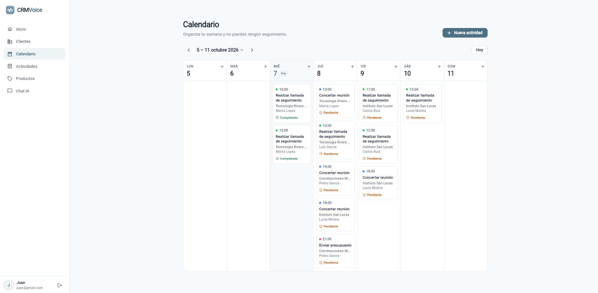
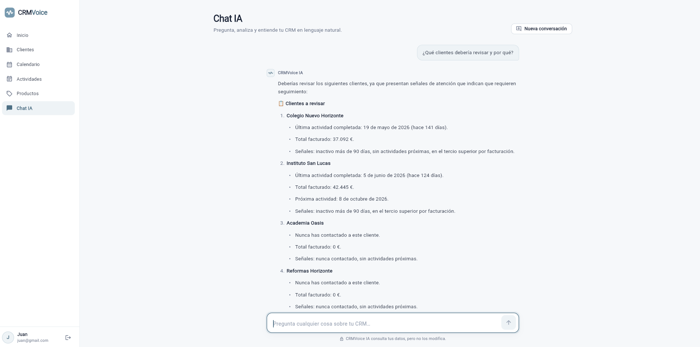

# CRMVoice

<p align="center">
  <strong>Tu CRM. Ahora también te escucha.</strong>
</p>

<p align="center">
  CRM comercial con voz e inteligencia artificial para gestionar clientes, contactos, actividades, productos y ventas utilizando lenguaje natural.
</p>

<p align="center">
  <code>Python</code> ·
  <code>FastAPI</code> ·
  <code>Flutter</code> ·
  <code>SQLite</code> ·
  <code>OpenAI</code> ·
  <code>Whisper</code> ·
  <code>GitHub Actions</code>
</p>

---



## Sobre CRMVoice

CRMVoice nace con una idea sencilla: reducir la fricción de actualizar un CRM.

En lugar de depender únicamente de formularios, el comercial puede explicar una acción de forma natural:

> “Programa una reunión mañana a las diez con Marta López de Tecnología Rivera para hablar del Portátil Luna 13.”

CRMVoice transcribe el audio, interpreta la intención, resuelve las entidades contra los datos reales del CRM y genera un borrador estructurado que el usuario puede revisar antes de confirmar cualquier cambio.

La voz no sustituye a la interfaz tradicional: la complementa. Clientes, contactos, actividades, calendario, productos y ventas también pueden gestionarse desde una interfaz gráfica completa.

El proyecto comenzó como mi **Trabajo de Fin de Grado en Ingeniería Informática** y posteriormente evolucionó hasta convertirse en un proyecto de portfolio más completo, con una arquitectura revisada, Action Engine, Chat IA, testing automatizado y una nueva experiencia de usuario.

---

## Funcionalidades principales

### 🎙️ Voice Action Engine

El núcleo diferencial de CRMVoice.

Permite convertir lenguaje natural, hablado o escrito, en operaciones estructuradas sobre el CRM.

Actualmente permite:

- crear actividades;
- crear clientes;
- crear contactos;
- registrar ventas;
- crear productos;
- actualizar productos.

Las eliminaciones sensibles, como borrar productos, permanecen deliberadamente fuera del flujo por voz.

Antes de escribir en el CRM, CRMVoice presenta siempre una revisión editable de la acción detectada.



El sistema diferencia coincidencias exactas, aproximadas, valores deducidos y ambigüedades. Si una entidad no puede resolverse de forma segura, solicita intervención del usuario en lugar de elegir silenciosamente.

---

### 👥 Gestión de clientes y contactos

CRMVoice incluye una cartera completa de clientes con búsqueda y gestión de contactos asociados.



Cada cliente dispone de una vista comercial unificada con:

- información empresarial;
- contactos;
- ventas registradas;
- facturación histórica;
- actividad reciente;
- próximas acciones comerciales.



Los clientes, contactos y productos forman parte del catálogo compartido del CRM. Las actividades y ventas pertenecen al comercial autenticado.

---

### 📅 Actividades y calendario

Las actividades comerciales pueden crearse manualmente o mediante el Action Engine.

El sistema permite trabajar con diferentes tipos de actividad, estados, fechas, contactos y productos relacionados.

La vista de calendario organiza el seguimiento comercial en una agenda semanal.



También existe una vista específica de Actividades con búsqueda, filtros y gestión de estados.

---

### 💰 Ventas y productos

CRMVoice permite registrar ventas con una o varias líneas de producto y mantener un catálogo comercial reutilizable.

El sistema diferencia entre:

- ventas registradas por el comercial;
- facturación histórica del cliente;
- facturación comercial agregada.

Los productos pueden utilizarse tanto desde los formularios tradicionales como desde acciones interpretadas mediante lenguaje natural.

---

### 🤖 Chat IA sobre el CRM

CRMVoice incluye un asistente conversacional para consultar los datos del CRM utilizando lenguaje natural.

No modifica información: el Chat IA funciona como una capa de consulta **read-only**.

Puede responder preguntas como:

- “¿Qué tengo pendiente esta semana?”
- “¿Cuánto he vendido este mes?”
- “¿Cómo va Tecnología Rivera?”
- “¿Qué clientes debería revisar y por qué?”



El asistente utiliza herramientas controladas por el backend para consultar información real del CRM. El modelo no decide directamente qué registros puede leer ni ejecuta SQL libre.

Entre otras capacidades, entiende:

- fechas relativas;
- nombres parciales;
- contexto conversacional;
- clientes y contactos activos;
- actividad comercial;
- ventas y facturación;
- productos tratados;
- señales deterministas de atención comercial.

---

## Cómo funciona una acción por voz

```text
Usuario
   │
   │ audio
   ▼
Whisper
   │
   │ transcripción
   ▼
Structured LLM Interpretation
   │
   │ menciones estructuradas
   ▼
Deterministic Entity Resolution
   │
   │ IDs + coincidencias + ambigüedades
   ▼
Persisted Action Draft
   │
   │ revisión editable
   ▼
Confirmación explícita del usuario
   │
   ▼
Transactional Write Services
   │
   ▼
CRM
```

### 1. Transcripción

El audio se procesa con Whisper para obtener el texto original de la acción.

### 2. Interpretación estructurada

El intérprete utiliza Structured Outputs para extraer únicamente la intención y las menciones relevantes.

El modelo no selecciona IDs de la base de datos ni escribe directamente en el CRM.

### 3. Resolución determinista

El backend resuelve clientes, contactos y productos contra el catálogo real.

Puede producir:

- coincidencias exactas;
- coincidencias aproximadas;
- valores deducidos;
- candidatos ambiguos;
- bloqueos cuando no existe suficiente información.

### 4. Action Draft

La interpretación se guarda como un borrador temporal y revisionado asociado al usuario.

El borrador puede editarse o descartarse antes de ejecutar la acción.

### 5. Confirmación

La confirmación vuelve a validar el borrador contra el estado actual de la base de datos y ejecuta la operación mediante los mismos servicios de escritura utilizados por los formularios tradicionales.

La confirmación es idempotente: repetirla no duplica la operación.

---

## Arquitectura

CRMVoice separa la interfaz, la capa HTTP, la lógica de negocio, la interpretación mediante IA y el acceso a datos.

```text
┌─────────────────────────────┐
│       Flutter Web App       │
│                             │
│ CRM · Voice · Chat IA · UI  │
└──────────────┬──────────────┘
               │ REST / JWT
               ▼
┌─────────────────────────────┐
│        FastAPI Backend      │
│                             │
│ Auth · CRM · Actions · Chat │
└──────┬───────────┬──────────┘
       │           │
       │           ├──────────────► OpenAI API
       │           │                Structured Outputs
       │           │                Tool Calling
       │
       ├──────────────────────────► Whisper
       │                            Speech-to-Text
       │
       ▼
┌─────────────────────────────┐
│           SQLite            │
│                             │
│ CRM · Users · Drafts · Chat │
└─────────────────────────────┘
```

### Backend

**Python + FastAPI**

Responsable de:

- autenticación JWT;
- Google OAuth;
- clientes y contactos;
- actividades;
- productos;
- ventas;
- Action Engine;
- resolución de entidades;
- Chat IA;
- persistencia;
- reglas de negocio.

### Frontend

**Flutter**

Aplicación responsive orientada principalmente a web con:

- autenticación;
- dashboard;
- clientes;
- calendario;
- actividades;
- productos;
- Chat IA;
- grabación de voz;
- revisión y confirmación de acciones.

### Persistencia

**SQLite**

La base de datos se crea y evoluciona mediante migraciones versionadas.

El fichero local de base de datos no forma parte del repositorio.

---

## Decisiones técnicas destacadas

### IA sin acceso directo a escrituras

El modelo interpreta lenguaje, pero no recibe libertad para modificar directamente la base de datos.

Las escrituras pasan por servicios de negocio controlados por el backend.

### Confirmación humana

Una interpretación por voz nunca se convierte automáticamente en una modificación del CRM.

El usuario revisa exactamente qué se va a guardar antes de confirmar.

### Resolución de entidades fuera del LLM

Los IDs de clientes, contactos y productos se determinan mediante lógica del backend.

Esto permite representar explícitamente coincidencias aproximadas y ambigüedades en lugar de ocultarlas detrás de una respuesta generativa.

### Chat IA read-only

El asistente utiliza una lista blanca de herramientas.

El backend:

- valida sus argumentos;
- inyecta el usuario autenticado;
- controla los IDs accesibles;
- limita las llamadas;
- ejecuta las consultas en modo de solo lectura.

### Escrituras centralizadas

Los formularios tradicionales y el Action Engine utilizan los mismos servicios de escritura.

Las reglas de negocio no están duplicadas entre la interfaz manual y la interfaz mediante IA.

---

## Stack

| Área | Tecnología |
|---|---|
| Frontend | Flutter / Dart |
| Backend | Python / FastAPI |
| Base de datos | SQLite |
| ORM / acceso a datos | SQL directo + servicios de dominio |
| Speech-to-Text | OpenAI Whisper |
| Interpretación IA | OpenAI API |
| Chat IA | OpenAI Tool Calling |
| Autenticación | JWT + Google OAuth |
| Validación backend | Pydantic |
| Testing backend | pytest |
| Testing frontend | flutter_test |
| CI | GitHub Actions |

---

## Testing y calidad

CRMVoice dispone de suites automatizadas independientes para backend y frontend.

### Backend

```bash
cd backend
pip install -r requirements-dev.txt
pytest
```

Los tests utilizan una base SQLite temporal y no modifican `backend/crm.db`.

Las integraciones externas como OpenAI, Google y Whisper se aíslan durante la suite.

### Frontend

```bash
cd frontend
flutter pub get
flutter test
flutter analyze --no-fatal-infos
```

Los tests utilizan dobles para HTTP y canales de plataforma, por lo que no requieren el backend real, Google OAuth ni acceso al micrófono.

### CI

GitHub Actions ejecuta automáticamente las validaciones de backend y frontend en pushes y pull requests de las ramas principales de desarrollo.

El pipeline no necesita secretos ni servicios externos.

---

## Ejecutar CRMVoice en local

### Requisitos

- Python 3.11+
- Flutter 3.38+
- Google Chrome
- FFmpeg
- OpenAI API key

---

### 1. Backend

Desde la raíz del repositorio:

```bash
cd backend
```

Crear un entorno virtual:

**Windows**

```bash
python -m venv venv
venv\Scripts\activate
```

**macOS / Linux**

```bash
python3 -m venv venv
source venv/bin/activate
```

Instalar dependencias:

```bash
pip install -r requirements.txt
```

> Whisper utiliza PyTorch y su instalación completa requiere más espacio que el backend base.

Crear la configuración local:

**Windows**

```bash
copy .env.example .env
```

**macOS / Linux**

```bash
cp .env.example .env
```

Configura al menos:

```env
OPENAI_API_KEY=...
SECRET_KEY=...
ALGORITHM=HS256
ACCESS_TOKEN_EXPIRE_MINUTES=60
```

Genera una `SECRET_KEY` segura, por ejemplo:

```bash
python -c "import secrets; print(secrets.token_urlsafe(64))"
```

Opcionalmente pueden configurarse:

```env
GOOGLE_CLIENT_ID=...
CORS_ORIGINS=http://localhost:5000
CRMVOICE_DB_PATH=...
```

---

### 2. Datos de demostración

La base de datos local no está incluida en el repositorio.

Para disponer de un catálogo ficticio con el que probar CRMVoice:

```bash
python seed_demo_data.py
```

Los datos generados por este script son ficticios.

---

### 3. Arrancar el backend

```bash
uvicorn main:app --reload --port 8000
```

Comprobación:

```text
http://127.0.0.1:8000/ping
```

Documentación interactiva de la API:

```text
http://127.0.0.1:8000/docs
```

Whisper carga el modelo en la primera transcripción. La primera ejecución puede tardar más mientras se descarga el modelo necesario.

---

### 4. Frontend

En otra terminal:

```bash
cd frontend
flutter pub get
```

Crear la configuración local:

**Windows**

```bash
copy dart_defines.example.json dart_defines.json
```

**macOS / Linux**

```bash
cp dart_defines.example.json dart_defines.json
```

El frontend admite:

```text
API_BASE_URL
GOOGLE_CLIENT_ID
```

Arrancar en Chrome:

```bash
flutter run -d chrome --web-port 5000 --dart-define-from-file=dart_defines.json
```

El puerto fijo `5000` facilita la configuración de Google OAuth durante el desarrollo.

---

## Google OAuth

Google Login es opcional. CRMVoice también permite autenticación mediante email y contraseña.

Para habilitarlo:

1. Crea un OAuth Client ID de tipo **Web application** en Google Cloud.
2. Añade como origen autorizado:

```text
http://localhost:5000
```

3. Configura el mismo `GOOGLE_CLIENT_ID` en backend y frontend.

El frontend obtiene el ID token de Google y el backend valida su firma, emisor, caducidad y audiencia antes de autenticar al usuario.

---

## Estructura del repositorio

```text
CRMVoice/
├── .github/
│   └── workflows/
│       └── ci.yml
│
├── assets/
│   └── screenshots/
│
├── backend/
│   ├── api/                # Routers HTTP y dependencias
│   ├── core/               # Seguridad, formatos y utilidades
│   ├── schemas/            # Modelos Pydantic
│   ├── services/
│   │   ├── actions/        # Action Engine
│   │   ├── crm_tools/      # Herramientas de consulta del CRM
│   │   └── writes/         # Servicios centralizados de escritura
│   ├── tests/
│   ├── db.py
│   ├── migrations.py
│   ├── seed_demo_data.py
│   └── requirements*.txt
│
├── frontend/
│   ├── lib/
│   │   ├── models/
│   │   ├── providers/
│   │   ├── screens/
│   │   ├── services/
│   │   └── widgets/
│   ├── test/
│   └── web/
│
├── LICENSE
└── README.md
```

---

## Estado del proyecto

CRMVoice se encuentra en fase de preparación final para portfolio.

### Completado

- autenticación email/password;
- Google OAuth;
- dashboard comercial;
- clientes y contactos;
- actividades;
- calendario;
- catálogo de productos;
- ventas;
- Voice Action Engine;
- acciones mediante texto;
- resolución determinista de entidades;
- revisión antes de confirmar acciones;
- Chat IA read-only;
- diseño responsive;
- suites automatizadas;
- CI con GitHub Actions.

### Pendiente

- deployment público;
- configuración de entorno de producción;
- demo pública controlada.

---

## Origen del proyecto

CRMVoice comenzó como mi **Trabajo de Fin de Grado en Ingeniería Informática**.

El objetivo inicial era explorar cómo la interacción por voz podía reducir la fricción del registro de información comercial.

Tras finalizar el TFG, el proyecto fue ampliado y refactorizado como proyecto de portfolio, incorporando una arquitectura más robusta, nuevas operaciones CRM, Action Engine, Chat IA, testing automatizado, CI y un rediseño completo de la experiencia de usuario.

---

## Autor

**Juan Marín Escolano**

Software Engineer · Computer Engineering

GitHub: `@milionhub`

---

## Licencia

Este proyecto está distribuido bajo la licencia [MIT](LICENSE).

Copyright © 2026 Juan Marín Escolano.